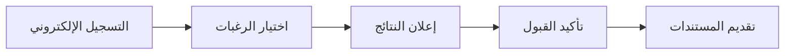

## نظرة عامة

ترحب جامعة القادسية بجميع الطلبة الراغبين بالانضمام إلى مسيرتها الأكاديمية. تتبع الجامعة معايير القبول المركزي المعتمدة من وزارة التعليم العالي والبحث العلمي.

---

## شروط القبول العامة

### للدراسة الصباحية
1. الحصول على شهادة الدراسة الإعدادية العراقية أو ما يعادلها
2. تحقيق المعدل المطلوب حسب الكلية والتخصص
3. اجتياز الفحص الطبي (للكليات الصحية)
4. عدم الفصل من جامعة أخرى لأسباب تأديبية

### للدراسة المسائية
1. نفس شروط الدراسة الصباحية
2. المعدلات المطلوبة تختلف عن الدراسة الصباحية

---

## معدلات القبول السابقة

| الكلية | الفرع العلمي | الفرع الأدبي |
|--------|-------------|-------------|
| الطب | 98+ | - |
| الهندسة | 85+ | - |
| العلوم | 70+ | - |
| الحقوق | - | 75+ |
| التربية | 65+ | 65+ |
| الإدارة والاقتصاد | 60+ | 60+ |

*ملاحظة: المعدلات أعلاه إرشادية وتتغير سنوياً حسب الطاقة الاستيعابية*

---

## المستندات المطلوبة

- وثيقة التخرج الأصلية مع صورة مصدقة
- هوية الأحوال المدنية
- البطاقة الوطنية
- شهادة الجنسية العراقية
- صور شخصية حديثة (6 صور)
- استمارة القبول المركزي

---

## مراحل التقديم

1. **التسجيل الإلكتروني**: عبر موقع دائرة القبول المركزي
2. **اختيار الرغبات**: ترتيب الكليات حسب الأولوية
3. **إعلان النتائج**: نشر نتائج القبول المركزي
4. **تأكيد القبول**: تأكيد الرغبة بالقبول
5. **تقديم المستندات**: إكمال ملف التسجيل

---

## التواصل

### قسم التسجيل
- **البريد الإلكتروني**: admission@qu.edu.iq
- **الهاتف**: +964 780 000 0000
- **ساعات العمل**: الأحد - الخميس، 8:00 ص - 3:00 م

---

## روابط مهمة

- [دائرة القبول المركزي](https://mohesr.gov.iq) *(رابط خارجي)*
- [الخطة الدراسية](/ar/students/admission-plans/)
- [التقويم الأكاديمي](/ar/media/calendar/)
